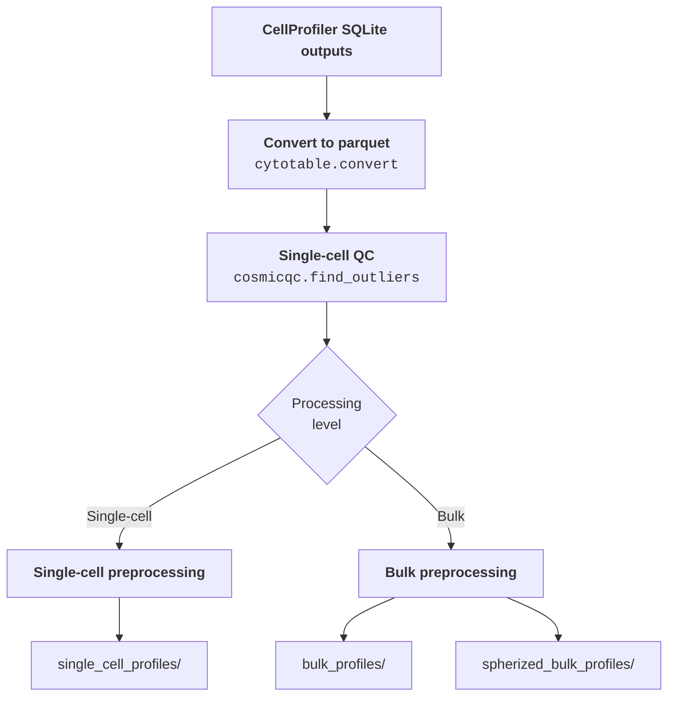
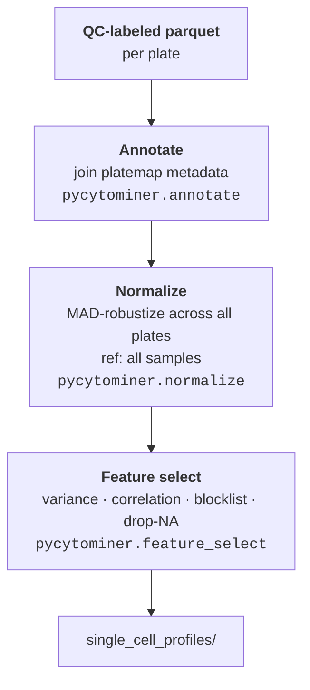
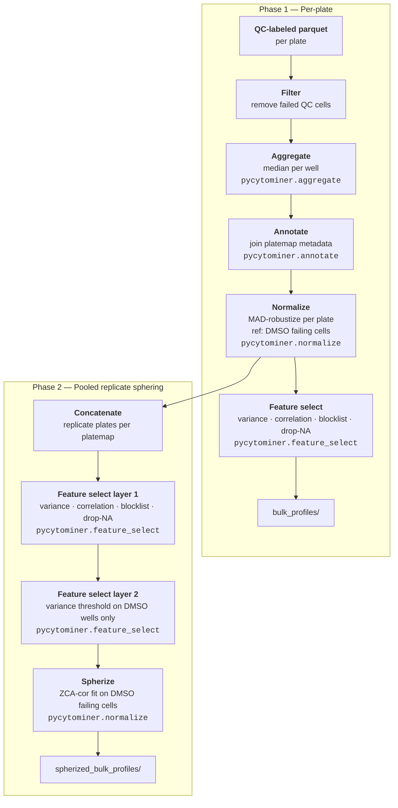

# Preprocessing single-cell profiles

In this module, we preprocess morphology features extracted from CellProfiler SQLite outputs.
We process the data at two levels: **single-cell** and **bulk** (well-level aggregated) profiles.
All files generated are in `parquet` file format.



## Run preprocessing

To run the full preprocessing pipeline, execute the bash script from this directory:

```bash
# Make sure your current working dir is the 3.preprocessing_features folder
source preprocess_features.sh
```

---

## Single-cell processing

Single-cell processing spans three steps, each implemented in a separate notebook:



### Step 0 — Convert CellProfiler outputs to parquet ([`0.convert_cytotable.ipynb`](0.convert_cytotable.ipynb))

CellProfiler produces per-plate SQLite files.
We use [CytoTable](https://github.com/cytomining/CytoTable) to merge the per-object tables into single-cell parquet files, one per plate.

### Step 1 — Single-cell quality control ([`1.sc_quality_control.ipynb`](1.sc_quality_control.ipynb))

We perform single-cell QC using [coSMicQC](https://github.com/cytomining/coSMicQC).
Outlier cells are identified via z-scores applied to combinations of morphology features (or individual features, depending on the condition).
Each cell is labeled as passing or failing QC; labeled profiles are written to `qc_labeled_profiles/`.

### Step 2 — Single-cell feature preprocessing ([`2.single_cell_processing.ipynb`](2.single_cell_processing.ipynb))

Starting from QC-labeled profiles, we use [pycytominer](https://github.com/cytomining/pycytominer) to:

1. **Annotate** — join well-level metadata from the platemap
2. **Normalize** — normalize across all plates together (we do not normalize per-plate because the healthy controls have only three wells, which is insufficient for plate-level normalization)
3. **Feature select** — apply variance threshold, correlation threshold, blocklist, and drop-NA-columns filters

Output profiles are written to `single_cell_profiles/`.

---

## Bulk processing

Bulk processing aggregates single-cell data to the well level before applying the same annotation → normalization → feature selection pipeline.



### Step 3 — Bulk feature preprocessing ([`3.bulk_processing.ipynb`](3.bulk_processing.ipynb))

Bulk processing happens in two phases: per-plate preprocessing and pooled-replicate sphering.

#### Phase 1: Per-plate preprocessing

For each plate, we apply the following steps using pycytominer:

1. **Filter** — remove single cells that failed any coSMicQC QC column before aggregating
2. **Aggregate** — compute median well-level profiles from passing single cells, stratified by plate and well
3. **Annotate** — join well-level metadata from the platemap; rename any mismatched metadata column names
4. **Normalize** — apply MAD-robustize normalization per plate, using DMSO wells from failing cells as the reference population
5. **Feature select** — apply variance threshold, correlation threshold, blocklist, and drop-NA-columns filters (per plate)

Per-plate outputs are written to `bulk_profiles/`.

#### Phase 2: Pooled-replicate sphering

After per-plate preprocessing, replicate plates sharing the same platemap are pooled together for a two-layer feature selection and sphering transform:

1. **Concatenate** — pool all MAD-normalized replicate plates that share a platemap
2. **Feature select (layer 1)** — apply variance threshold, correlation threshold, blocklist, and drop-NA-columns filters to the pooled profiles to obtain a common feature set
3. **Feature select (layer 2)** — apply a second variance threshold filter using only the DMSO negative-control wells, removing features with too little variation in the reference population
4. **Spherize** — apply ZCA-cor sphering (with centering and epsilon=1e-6), fit on the pooled DMSO negative-control wells, to decorrelate features and place all profiles on a shared control-based covariance scale

Spherized outputs are written to `spherized_bulk_profiles/`.

---

## Hit calling

Downstream hit calling is applied to the preprocessed profiles using two complementary approaches:

- **Machine learning classifiers** — applied to single-cell feature selected profiles (`single_cell_profiles/`) to predict perturbations that shift cells toward a healthy phenotype, following the approach described in [Travers et al. (*Circulation*, 2024)](https://doi.org/10.1161/CIRCULATIONAHA.124.071956)
- **mAP (mean Average Precision)** — applied to spherized bulk profiles (`spherized_bulk_profiles/`) to score compound activity at the well level
