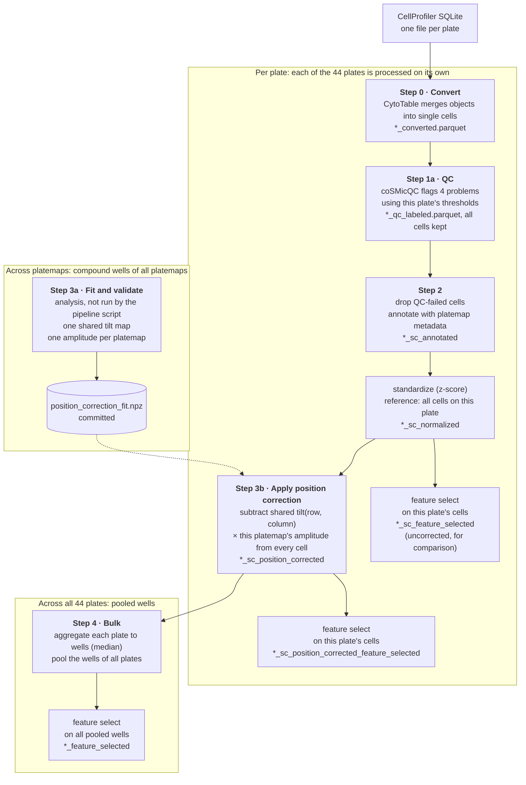
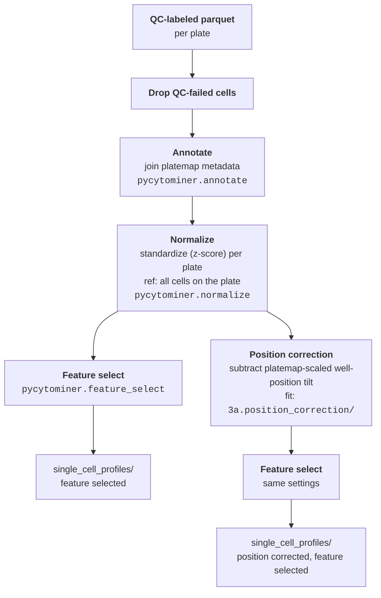
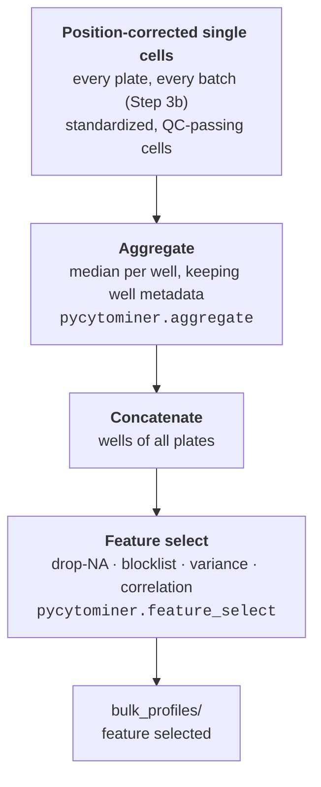

# Image-based profiling

In this module, we perform image-based profiling on the morphology features that CellProfiler extracted into SQLite outputs in module 2.
We use CytoTable to convert the features to parquet, identify poor-quality cells, correct plate-position effects, and generate **single-cell** and **bulk** (well-level aggregated) profiles.
The screen has 44 plates (11 platemap layouts with 4 replicate plates each) in three batches.



Dotted arrows show inputs that a step reads.
The pipeline script does not run Step 3a.

## Steps

| Step | Notebook or folder | What it does | Main outputs |
|---|---|---|---|
| 0 | [`0.convert_cytotable.ipynb`](0.convert_cytotable.ipynb) | Convert CellProfiler SQLite files to parquet | `converted_profiles/` |
| 1a | [`1a.sc_quality_control.ipynb`](1a.sc_quality_control.ipynb) | Label cells that fail single-cell QC | `qc_labeled_profiles/`, `qc_figures/` |
| 1b | [`1b.sc_qc_results.ipynb`](1b.sc_qc_results.ipynb) | Summarize the percentage of cells that fail single-cell QC per plate | `qc_figures/` |
| 2 | [`2.single_cell_processing.ipynb`](2.single_cell_processing.ipynb) | Drop QC-failed cells, annotate, normalize, and feature select single cells | `single_cell_profiles/` (`*_sc_annotated`, `*_sc_normalized`, `*_sc_feature_selected`) |
| 3a | [`3a.position_correction/`](3a.position_correction/) | Estimate, validate, and investigate the plate-position correction | `position_correction_fit.npz`, tables, and figures |
| 3b | [`3b.apply_position_correction.ipynb`](3b.apply_position_correction.ipynb) | Apply the correction, then feature select | `single_cell_profiles/` (`*_sc_position_corrected`, `*_sc_position_corrected_feature_selected`) |
| 4 | [`4.bulk_processing.ipynb`](4.bulk_processing.ipynb) | Aggregate position-corrected cells to wells, pool all plates, and feature select once | `data/bulk_profiles/` |

## Module contents

```text
4.image_based_profiling/
├── 0.convert_cytotable.ipynb            Step 0
├── 1a.sc_quality_control.ipynb          Step 1a
├── 1b.sc_qc_results.ipynb               Step 1b: summarize single-cell QC failures per plate
├── 2.single_cell_processing.ipynb       Step 2
├── 3a.position_correction/              Step 3a: fit, validate, and investigate the correction (committed fit, tables, and figures)
├── 3b.apply_position_correction.ipynb   Step 3b
├── 4.bulk_processing.ipynb              Step 4
├── nbconverted/                         script version of each step
├── optimize_thresholds_notebooks/       per-plate notebooks that derive the QC thresholds
├── sc_qc_thresholds.json                QC thresholds for each platemap and plate
├── blocklist_features.txt               features that feature selection removes
├── qc_figures/                          QC outlier figures
├── preprocess_features.sh               runs the pipeline
└── data/                                profiles (git ignores this folder)
```

Each batch and platemap has its own folder in `data/`:

```text
data/
├── <batch>/<platemap>/
│   ├── converted_profiles/      <plate>_converted.parquet
│   ├── qc_labeled_profiles/     <plate>_qc_labeled.parquet
│   └── single_cell_profiles/    <plate>_sc_annotated.parquet
│                                <plate>_sc_normalized.parquet
│                                <plate>_sc_feature_selected.parquet
│                                <plate>_sc_position_corrected.parquet
│                                <plate>_sc_position_corrected_feature_selected.parquet
└── bulk_profiles/               bulk_position_corrected_feature_selected.parquet
```

## Run the pipeline

Create the preprocessing environment from [`environments/preprocessing_env.yml`](../environments/preprocessing_env.yml) (`fibrosis_preprocessing_env`).
To run the pipeline from conversion through bulk processing, execute the bash script from this directory:

```bash
# Make sure your current working dir is the 4.image_based_profiling folder
source preprocess_features.sh
```

## Conversion and quality control

### Step 0 — Convert CellProfiler outputs to parquet ([`0.convert_cytotable.ipynb`](0.convert_cytotable.ipynb))

CellProfiler produces per-plate SQLite files.
We use [CytoTable](https://github.com/cytomining/CytoTable) with the `cellprofiler_sqlite_pycytominer` preset to merge the per-object tables into single-cell parquet files, one per plate.
We extend the preset to include the image site and cell count, and the image path columns.
The step writes the outputs to `converted_profiles/` as `<plate>_converted.parquet`.

### Step 1a — Single-cell quality control ([`1a.sc_quality_control.ipynb`](1a.sc_quality_control.ipynb))

We perform single-cell QC using [coSMicQC](https://github.com/cytomining/coSMicQC).
coSMicQC identifies outlier cells with z-score thresholds on morphology features.
Each cell receives four pass or fail labels (`Metadata_cqc_failed_*` columns):

| Label | Detects | Features |
|---|---|---|
| `oversegmented_nuclei` | over-segmented nuclei | nuclei solidity and DNA mass displacement |
| `low_intensity` | background that segmentation mistakes for nuclei | nuclei mean DNA intensity |
| `small_cells` | under-segmented cells | cell area |
| `blurry_cells` | out-of-focus cells | actin granularity |

Each platemap and plate has its own thresholds in `sc_qc_thresholds.json`.
We derived them in the per-plate notebooks in `optimize_thresholds_notebooks/`.
The pipeline script runs the notebook once per plate with papermill, passing the platemap and plate as parameters.

### Step 1b — Summarize single-cell QC failures ([`1b.sc_qc_results.ipynb`](1b.sc_qc_results.ipynb))

This step reads every `<plate>_qc_labeled.parquet` file in `data/`, labels each plate with an alias (for example `1A` to `1D` for platemap 1), and plots the percentage of cells that fail any single-cell QC label per plate.
It writes the figure to `qc_figures/`.

---

## Single-cell processing



### Step 2 — Single-cell feature preprocessing ([`2.single_cell_processing.ipynb`](2.single_cell_processing.ipynb))

Starting from the QC-labeled profiles of each plate, we use pycytominer to:

1. **Drop QC-failed cells** — remove every cell that any `Metadata_cqc_failed_*` column flags
2. **Annotate** — join well-level metadata (treatment, cell type, heart, pathway) from the platemap files in `../metadata/updated_platemaps/`, using `updated_barcode_platemap.csv` to find each plate's platemap
3. **Normalize** — standardize (z-score) each plate's features using all cells on the plate as the reference
4. **Feature select** — apply drop-NA-columns, blocklist, variance threshold, and correlation threshold filters

The step writes these outputs to `single_cell_profiles/`:

- `<plate>_sc_annotated.parquet`: QC-passing cells with metadata
- `<plate>_sc_normalized.parquet`: standardized profiles with all features
- `<plate>_sc_feature_selected.parquet`: standardized profiles after feature selection

### Step 3a — Estimate the position correction ([`3a.position_correction/`](3a.position_correction/))

Where a well sits on the plate shifts its profile in a consistent, feature-specific direction (a "tilt") that is unrelated to the well contents.
We estimate the tilt from the normalized profiles of all plates and study its effect in four notebooks, each with a script in `nbconverted/`:

- [`fit_position_correction.ipynb`](3a.position_correction/fit_position_correction.ipynb) estimates one tilt that all platemaps share and one amplitude per platemap, and writes `position_correction_fit.npz` along with diagnostics.
- [`validate_position_correction.ipynb`](3a.position_correction/validate_position_correction.ipynb) tests the correction on held-out platemaps.
- [`effect_on_feature_space.ipynb`](3a.position_correction/effect_on_feature_space.ipynb) shows what the correction does to the features and to the well profiles.
  It measures the size of the tilt of each feature family, and it projects the wells into the principal components of the uncorrected wells before and after the correction.
  It saves `tilt_size_by_feature.csv`, `well_pca_scores.csv`, and `pc_variance_explained_by_row.csv` in the folder.
- [`plot_effect_on_feature_space.ipynb`](3a.position_correction/plot_effect_on_feature_space.ipynb) (R) draws the figures of those tables in `figures/`: `tilt_size_by_feature_family.png`, `well_pca_before_after_by_row.png`, and `plate_layout_top_row_pc_before_after.png`.

The two notebooks that investigate the effect read `position_correction_fit.npz` and the `well_medians.parquet` cache, which `fit_position_correction.ipynb` writes and git ignores, so run the fit notebook first.
The helper functions are in `utils/position_correction_effect_utils.py`.

### Step 3b — Apply the position correction ([`3b.apply_position_correction.ipynb`](3b.apply_position_correction.ipynb))

This step applies the saved fit to the normalized profiles from Step 2, then performs feature selection on the corrected profiles with the same settings as Step 2.

For every cell, we subtract `amplitude x tilt(row, column)` from the features, where the amplitude is specific to the platemap.
We shift all cells in a well by the same amount.
We correct controls like all other wells.

For each plate, the step reads `<plate>_sc_normalized.parquet` and writes two files to `single_cell_profiles/`:

- `<plate>_sc_position_corrected.parquet`: normalized profiles after correction
- `<plate>_sc_position_corrected_feature_selected.parquet`: corrected profiles after feature selection

---

## Bulk processing

Bulk processing is the final step of the module.
It aggregates the position-corrected single-cell profiles from Step 3b to the well level, pools the wells of all plates in all batches, then performs one feature selection on the pooled profiles.
Step 2 already standardizes the single-cell profiles per plate and Step 3b corrects their position, so bulk processing needs no separate normalization step.



### Step 4 — Bulk profiling ([`4.bulk_processing.ipynb`](4.bulk_processing.ipynb))

This step reads every plate in every batch, so it runs once after all batches have completed Step 3b.
We start from the `<plate>_sc_position_corrected.parquet` files and:

1. **Aggregate** — compute the median profile of each well, using the plate, well, and well-level metadata (treatment, cell type, heart, and pathway) as strata
   Step 2 already removed the QC-failed cells.
2. **Concatenate** — pool the wells of all plates, adding `Metadata_Batch` and `Metadata_Platemap` (from the folder names) so downstream steps can group wells
3. **Feature select** — apply drop-NA-columns, blocklist, variance threshold, and correlation threshold filters to the pooled profiles to obtain a common feature set

Step 4 writes its output, which covers all plates, to `data/bulk_profiles/`:

- `bulk_position_corrected_feature_selected.parquet`: pooled profiles after feature selection

---
