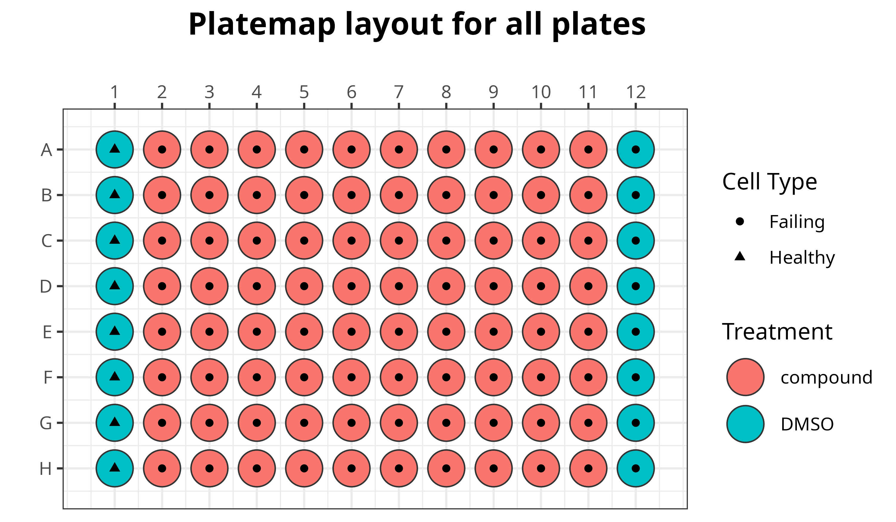

# Targeted Fibrosis Drug Screen

In this repository, we perform image analysis and image-based profiling on a cardiac fibroblast drug screen and will apply a machine learning model generated to predict healthy versus failing cells to identify optimal compounds to treat fibrosis.

## Plate map details

There are a total of 7 plates with 550 compound treatments and two controls (DMSO treated failing and healthy cells).

For this dataset, the Cell Painting staining switches the cytoplasmic RNA/nucleoli stain for a specific F-action stain:

- Nuclei
- Endoplasmic Reticulum
- Golgi/Plasma Membrane
- Mitochondria
- F-actin

> This plate map layout is the same for all 7 plates, but with different compounds. 

## Environments

We utilize ___ environments for our repository.

1. [r_fibrosis_env](./r_fibrosis_env.yml): This conda environment is specific to R, which we use for generating figures.
