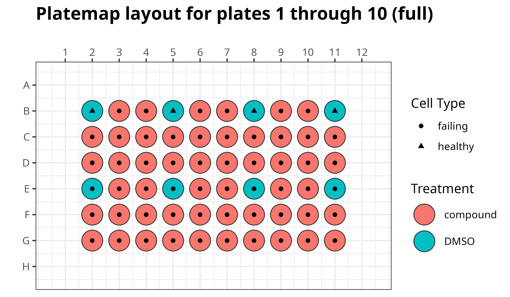
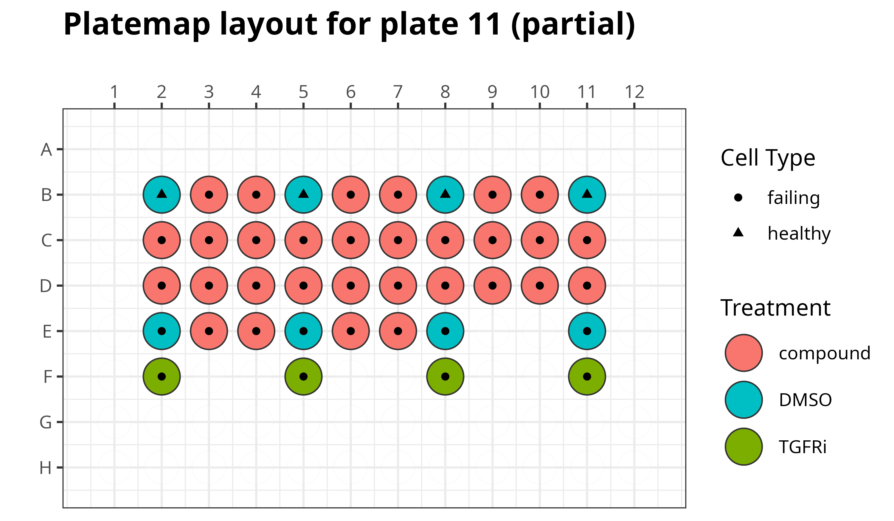

# Cardiac Fibrosis Rescue Screen Profiling

This repository contains the image analysis and image-based profiling pipeline for a cardiac fibroblast drug screen.
It turns raw Cell Painting images into single-cell and bulk (well-level) morphology profiles for the 44 screen plates and the validation plate.
This repository does not train models or call hits.
The [cardiac_fibrosis_rescue_screen_hit_calling](https://github.com/WayScience/cardiac_fibrosis_rescue_screen_hit_calling) repository uses the profiles for those analyses.

## The screen

- 11 plate map layouts with 4 replicate plates each (44 plates in three batches), plus one validation plate
- 550 small molecule treatments and two controls: DMSO-treated failing and non-failing (healthy) cells
- A TGF-β receptor inhibitor positive control on the 11th, partial layout
- A modified Cell Painting stain that swaps the RNA/nucleoli stain for F-actin, giving five channels:
  nuclei (d4), endoplasmic reticulum (d3), Golgi/plasma membrane (d2), mitochondria (d1), and F-actin (d0)



> This plate map layout is the same for plates 1 through 10.



> This plate map layout is specific to plate 11, which is a partial plate.

## Pipeline

Each numbered module has a README with details and a bash script that runs it.

| Module | What it does |
|---|---|
| [`0.download_data`](./0.download_data/) | Instructions for downloading the images |
| [`1.whole_image_qc`](./1.whole_image_qc/) | Flag over-saturated and blurry images with CellProfiler |
| [`2.illumination_correction`](./2.illumination_correction/) | Correct uneven illumination and skip images that fail QC |
| [`3.cellprofiler_processing`](./3.cellprofiler_processing/) | Segment cells and extract morphology features with CellProfiler |
| [`4.image_based_profiling`](./4.image_based_profiling/) | Convert features to parquet, filter poor-quality cells, normalize, correct plate-position effects, and aggregate to **single-cell** and **bulk** profiles |
| [`5.validation_plate_profiling`](./5.validation_plate_profiling/) | Runs the same steps (illumination correction through bulk profiles) on the validation plate |

Supporting folders:

- [`metadata`](./metadata/): plate maps and barcodes, including treatment and pathway annotations
- [`utils`](./utils/): shared helper functions
- [`environments`](./environments/): conda environments

## Environments

1. [CellProfiler environment](./environments/cellprofiler_env.yml) (`fibrosis_cp_env`): CellProfiler, for image QC, illumination correction, and feature extraction (modules 1, 2, 3, and the validation plate equivalents)
2. [Preprocessing environment](./environments/preprocessing_env.yml) (`fibrosis_preprocessing_env`): pycytominer, CytoTable, and coSMicQC, for image-based profiling (module 4 and the validation plate profiling)

Create an environment with conda or mamba from the root of this repository:

```bash
mamba env create -f environments/preprocessing_env.yml
```

[`environments/hpc_create_envs.sh`](./environments/hpc_create_envs.sh) creates all environments on a Slurm cluster.

## Outputs

The pipeline produces single-cell and bulk profiles, which module 4 documents in detail.
Large intermediate files, such as images and parquet files, are not tracked by git.
