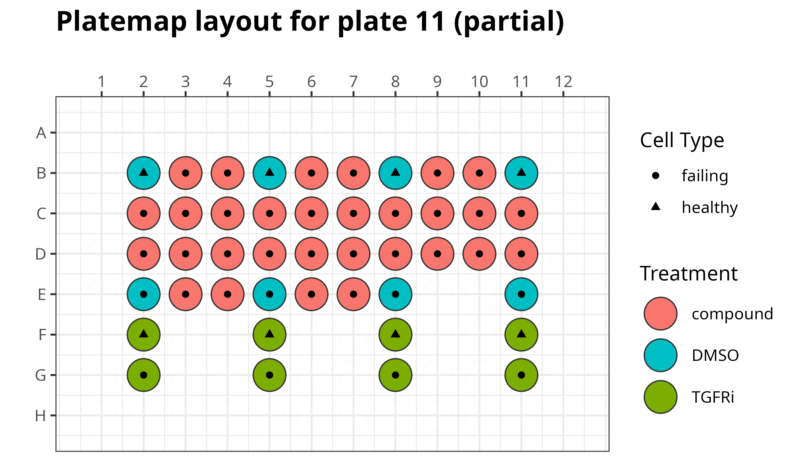

# Targeted Fibrosis Drug Screen

In this repository, we perform image analysis and image-based profiling on a cardiac fibroblast drug screen and will apply a machine learning model generated to predict healthy versus failing cells to identify optimal compounds to treat fibrosis.

## Plate map details

There are 11 plate map layouts, with 4 replicates per layout.
There are a total of 44 plates with 550 small molecule treatments and two controls (DMSO treated failing and non-failing/healthy cells).
We include another positive control using TGFRi on the 11th platemap layout (transforming growth factor beta inhibitor or TGF-β inhibitor).

For this dataset, the Cell Painting staining switches the cytoplasmic RNA/nucleoli stain for a specific F-actin stain:

- Nuclei
- Endoplasmic Reticulum
- Golgi/Plasma Membrane
- Mitochondria
- F-actin


> This plate map layout is the same for plates 1 through 10.



> This plate map layout specifically for plate 11 which is a partial plate.

## Environments

We utilize three environments for our repository.

1. [CellProfiler environment](./cellprofiler_env.yml): This environment installs CellProfiler, which we use for the illumination correction and feature extraction modules.
2. [R environment](./r_fibrosis_env.yml): This environment is specific to R, which we use for generating figures.
3. [Preprocessing environment](./preprocessing_env.yml): This environment installs preprocessing softwares (pycytominer, CytoTable, coSMicQC) to format the morphological readouts as single-cell profiles.
4. [Machine learning environment](./machine_learning_env.yml): This environment is used in the module for applying the pre-trained model on the data and evaluating the results for "hits" that could be reversing fibrosis.

These environments can be installed either via conda or mamba.
Below is an example of how to install via the terminal.

```bash
# Make sure to be in this repo as the current directory
mamba env create -f ...
```
